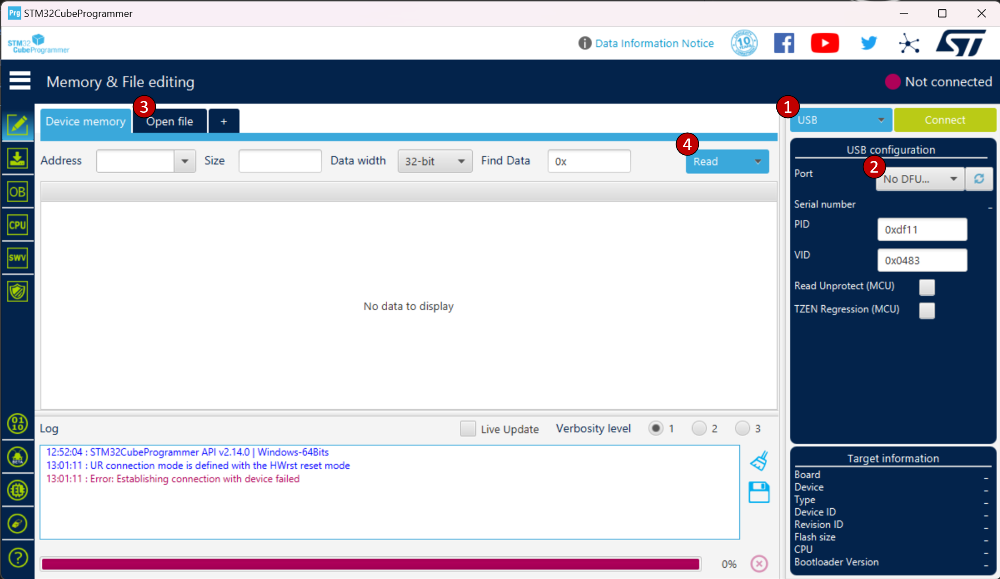

# Whale Tag Recovery Board: Deployment Handbook

Contents:
- [APRS](#aprs)
- [Updating Firmware](#updating-firmware)

## APRS
***ToDo: Description of APRS packet sent by recovery board (frequency/information)***

## Updating Firmware

### Tools:
- [STM32CubeProgrammer](https://www.st.com/en/development-tools/stm32cubeprog.html)

### Instructions:

1) Download the latest binary from releases or build an .elf file following the instructions in the [README](README.md) file.  

1) Connect the USB-B end of the recovery board programming cable to your computer.

1) Attach the magnetic connector to the tag as seen in this image:
    
    ***ToDo: add image of connector on tag***

1) If the tag is off, turn it on; OR if the tag is already on, wait ~10 seconds with the programming cable attached to the tag. The red LED on the recovery board should flash 5 times an then turn off. You are now in USB bootloading mode.

1) In STM32CubeProgrammer:
    
    1) Select `USB` from the drop down.

    2) Refresh devices, to find the recovery board.

    3) Select `Open file`, and select your .elf file.

    4) Press the `Download` button to upload the new firmware to the recovery board.

    

1) Once downloaded successfully, turn off the tag and disconnect programming cable. 
